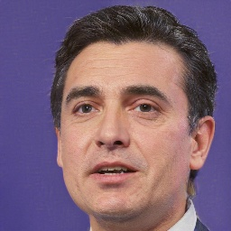
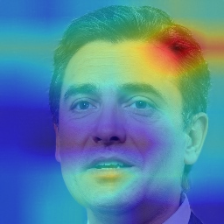
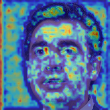
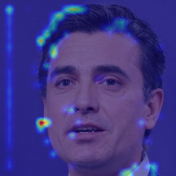
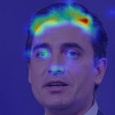

# Fake Face Detection : Which facial parts are CNNs looking?

<div align="center"></div>

## Code architecture
---

```
.
├── checkpoint.py
├── configs
│   ├── DenseNet.yaml
│   ├── EfficientNet.yaml
│   ├── ResNet.yaml
│   └── VGG.yaml
├── data
│   ├── face_images.csv
│   ├── fake
│   ├── real
│   ├── submission.csv
│   └── test
├── dataset.py
├── demo.py
├── flags.py
├── LICENSE
├── log
│   ├── DenseNet
│   ├── EfficientNet
│   ├── ResNet
│   └── VGG
├── metrics.py
├── networks
│   ├── ResNet.py
│   └── VGG.py
├── README.md
├── results
│   ├── 0-resnet18-deconvnet-Fake.png
│   ├── 0-resnet18-gradcam-layer1-Fake.png
│   ├── 0-resnet18-gradcam-layer2-Fake.png
│   ├── 0-resnet18-gradcam-layer3-Fake.png
│   ├── 0-resnet18-gradcam-layer4-Fake.png
│   ├── 0-resnet18-guided-Fake.png
│   ├── 0-resnet18-guided_gradcam-layer1-Fake.png
│   ├── 0-resnet18-guided_gradcam-layer2-Fake.png
│   ├── 0-resnet18-guided_gradcam-layer3-Fake.png
│   ├── 0-resnet18-guided_gradcam-layer4-Fake.png
│   └── 0-resnet18-vanilla-Fake.png
├── samples
│   ├── fake2.jpg
│   ├── fake.jpg
│   └── real.jpg
├── shape_predictor_68_face_landmarks.dat
├── train.py
├── utils.py
└── visualize.py
```

## Library
```bash
$ pip install -r requirements.txt
```


## Data
---
Sampling data from Kaggle Dataset Flickr-Faces-HQ (FFHQ) which is a high-quality image dataset of human faces, originally created as a benchmark for generative adversarial networks (GAN).

- [Thread for real faces dataset](https://www.kaggle.com/c/deepfake-detection-challenge/discussion/122786)
- [1 Million Fake faces](https://www.kaggle.com/c/deepfake-detection-challenge/discussion/121173)


## Train
---

```bash
$ python train.py --config_file=configs/ResNet.yaml
``` 

Training took 30 seconds per 1 epoch (GTX3080).
```
--------------------------------
Running ResNet on device cuda

[+] System environments
 Device: GeForce RTX 3080
 Random seed : 42
 The number of gpus : 1
 The number of cpus : 20
 Memory Size : 26G

[+] Data
 Train path : data/face_images.csv
 Test path : 
 Batch size : 32
 Valid proportions : 0.2
 The number of train samples : 16,000
 The number of valid samples : 4,000

[+] Network
 Type: ResNet
 Model parameters: 11,177,538

[+] Optimizer
 Type: Adam
 Learning rate: 0.0001
 Weight Decay: 0.01

[ 1/20] Epoch 1: Train Accuracy = 90.83125, Train Loss = 0.21522, Valid Accuracy = 95.95000, Valid Loss = 0.10759, lr = 0.0001 (time elapsed 00:00:24)
```

You can change YAML file in `configs` folder.
```yaml
network: "ResNet"

seed: 42
device: 'cuda'

data:
  train: "data/face_images.csv"
  test: ""
  random_split: True # if True, random split from train files
  test_proportions: 0.2 # only if random_split is True
  crop: True
  num_classes: 2

input_size:
  height: 224
  width: 224

model:
  in_channels: 3
  init_weights: True

optimizer:
  type: 'Adam' # Adam, Adadelta
  lr: 1e-4 # 1e-4
  weight_decay: 1e-2

# checkpoint: "" 
checkpoint: "./log/ResNet/checkpoints/0013.pth" # continue to learn or run demo

prefix: "./log/ResNet"

batch_size: 32
num_workers: 8
num_epochs: 20
print_epochs: 1
dropout_rate: 0.1
EARLY_STOPPING_EPOCH: 5

```

## Visualize
---

```bash
$ python visualize.py --arch=resnet18
                      --model_path=log/ResNet/checkpoints/0013.pth 
                      --target_layer=layer4 
                      --image_paths=samples/fake.jpg
``` 

```
image_paths=samples/fake.jpg
Device: GeForce RTX 3080
----------------------------------------------------------------
        Layer (type)               Output Shape         Param #
================================================================
            Conv2d-1         [32, 64, 112, 112]           9,408
       BatchNorm2d-2         [32, 64, 112, 112]             128
              ReLU-3         [32, 64, 112, 112]               0

                            ... SKIP ...

       BasicBlock-66            [32, 512, 7, 7]               0
        AvgPool2d-67            [32, 512, 1, 1]               0
           Linear-68                    [32, 2]           1,026
================================================================
Total params: 11,177,538
Trainable params: 11,177,538
Non-trainable params: 0
----------------------------------------------------------------
Input size (MB): 18.38
Forward/backward pass size (MB): 2009.13
Params size (MB): 42.64
Estimated Total Size (MB): 2070.14
----------------------------------------------------------------
Images:
        #0: samples/fake.jpg
Vanilla Backpropagation:
        #0: Fake (0.66083)
Deconvolution:
        #0: Fake (0.66083)
Grad-CAM/Guided Backpropagation/Guided Grad-CAM:
        #0: Fake (0.66083)
```

<div align="center"></div>

## Demo
---

```bash
$ python visualize.py --arch=resnet18
                      --model_path=log/ResNet/checkpoints/0013.pth 
                      --target_layer=layer4 
                      --image_paths=samples/fake.jpg
``` 

```
--------------------------------
Running ResNet on device cuda
WARNING: THIS IS DEMO MODE!!

[+] System environments
 Device: GeForce RTX 3080
 Random seed : 42
 The number of gpus : 1
 The number of cpus : 20
 Memory Size : 26G

[+] Network
 Type: ResNet
 Checkpoint: ./log/ResNet/checkpoints/0013.pth
 Model parameters: 11,177,538

----------------------------------------------------------------
        Layer (type)               Output Shape         Param #
================================================================
            Conv2d-1         [32, 64, 112, 112]           9,408
       BatchNorm2d-2         [32, 64, 112, 112]             128
              ReLU-3         [32, 64, 112, 112]               0

                            ... SKIP ...

       BasicBlock-66            [32, 512, 7, 7]               0
        AvgPool2d-67            [32, 512, 1, 1]               0
           Linear-68                    [32, 2]           1,026
================================================================
Total params: 11,177,538
Trainable params: 11,177,538
Non-trainable params: 0
----------------------------------------------------------------
Input size (MB): 18.38
Forward/backward pass size (MB): 2009.13
Params size (MB): 42.64
Estimated Total Size (MB): 2070.14
----------------------------------------------------------------
[+] Result
 Image path: samples/fake.jpg
 This image is Fake(0.66083)
```

## Contact
---
Minsuk Sung: minsuksung@korea.ac.kr

## License
---


The class is licensed under the [MIT License](http://opensource.org/licenses/MIT):

Copyright (c) 2020 FBA SYSTEM TRADING TEAM

Permission is hereby granted, free of charge, to any person obtaining a copy of this software and associated documentation files (the "Software"), to deal in the Software without restriction, including without limitation the rights to use, copy, modify, merge, publish, distribute, sublicense, and/or sell copies of the Software, and to permit persons to whom the Software is furnished to do so, subject to the following conditions:

The above copyright notice and this permission notice shall be included in all copies or substantial portions of the Software.

THE SOFTWARE IS PROVIDED "AS IS", WITHOUT WARRANTY OF ANY KIND, EXPRESS OR IMPLIED, INCLUDING BUT NOT LIMITED TO THE WARRANTIES OF MERCHANTABILITY, FITNESS FOR A PARTICULAR PURPOSE AND NONINFRINGEMENT. IN NO EVENT SHALL THE AUTHORS OR COPYRIGHT HOLDERS BE LIABLE FOR ANY CLAIM, DAMAGES OR OTHER LIABILITY, WHETHER IN AN ACTION OF CONTRACT, TORT OR OTHERWISE, ARISING FROM, OUT OF OR IN CONNECTION WITH THE SOFTWARE OR THE USE OR OTHER DEALINGS IN THE SOFTWARE.