# Fake Face Detection : Which facial parts are CNNs looking?

<div align="center">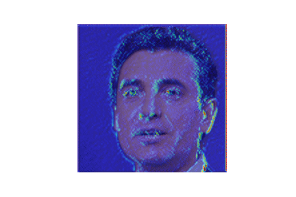</div>

<br>
<br>
<div align="right">Minsuk Sung</div>
<div align="right">Dept. of A.I, Korea Univ</div>
<div align="right">minsuksung@korea.ac.kr</div>
<br>
<br>

## Abstract
> Recently, deepfake technology used in fake news and virtuous videos has emerged as a social issue around the world. Deepfake is a method that uses deep learning technology to create maliciously crafted voices, images, and video. These technique is being exploited for a variety of crimes based on fast development speed and easy accessibility. Thus, while various methods for detecting deepfakes have been much studied, we still do not have many ways to know on what basis they are fake, even if we look at fake images. In this paper, we introduce many facial manipulation techniques and show that which facial part deep learning models are looking.

## Code architecture

```
.
├── checkpoint.py
├── configs
│   ├── DenseNet.yaml
│   ├── EfficientNet.yaml
│   ├── ResNet.yaml
│   └── VGG.yaml
├── data
│   ├── face_images.csv
│   ├── fake
│   ├── real
│   ├── submission.csv
│   └── test
├── dataset.py
├── demo.py
├── flags.py
├── LICENSE
├── log
│   ├── DenseNet
│   ├── EfficientNet
│   ├── ResNet
│   └── VGG
├── metrics.py
├── networks
│   ├── ResNet.py
│   └── VGG.py
├── README.md
├── results
│   ├── pretrained
│   └── no-pretrained
├── samples
│   ├── fake2.jpg
│   ├── fake.jpg
│   └── real.jpg
├── shape_predictor_68_face_landmarks.dat
├── train.py
├── utils.py
└── visualize.py
```

## Environments & Library

Python 3.7 is used for this project. You should create new virtual environments under identical conditions.

```bash
$ conda create -n fakeface python=3.7
$ conda activate fakeface
```

The `requirements.txt` file should list all Python libraries that your notebooks depend on, and they will be installed using:

```bash
$ pip install -r requirements.txt
```


## Dataset

Sampling data from Kaggle Dataset Flickr-Faces-HQ (FFHQ) which is a high-quality image dataset of human faces, originally created as a benchmark for generative adversarial networks (GAN).

- [Thread for real faces dataset](https://www.kaggle.com/c/deepfake-detection-challenge/discussion/122786)
- [1 Million Fake faces](https://www.kaggle.com/c/deepfake-detection-challenge/discussion/121173)

You can download my sampling dataset in Google Drive [here](https://drive.google.com/file/d/1WkBpVVXPPgvrpRrf9d3eluuXyFNUqRiR/view?usp=sharing).


## train.py

```bash
$ python train.py --config_file=configs/ResNet.yaml
``` 

Training took 30 seconds per 1 epoch (GTX3080).
```
--------------------------------
Running ResNet on device cuda

[+] System environments
 Device: GeForce RTX 3080
 Random seed : 42
 The number of gpus : 1
 The number of cpus : 20
 Memory Size : 26G

[+] Data
 Train path : data/face_images.csv
 Test path : 
 Batch size : 32
 Valid proportions : 0.2
 The number of train samples : 16,000
 The number of valid samples : 4,000

[+] Network
 Type: ResNet
 Model parameters: 11,177,538

[+] Optimizer
 Type: Adam
 Learning rate: 0.0001
 Weight Decay: 0.01

[ 1/20] Epoch 1: Train Accuracy = 90.83125, Train Loss = 0.21522, Valid Accuracy = 95.95000, Valid Loss = 0.10759, lr = 0.0001 (time elapsed 00:00:24)
```

You can change YAML file in `configs` folder.
```yaml
network: "ResNet"

seed: 42
device: 'cuda'

data:
  train: "data/train.csv"
  test: "data/test.csv"
  random_split: True # if True, random split from train files
  test_proportions: 0.2 # only if random_split is True
  crop: True
  num_classes: 2

input_size:
  height: 224
  width: 224

model:
  pretrained: False
  in_channels: 3
  init_weights: True

optimizer:
  type: 'Adam' # Adam, Adadelta
  lr: 1e-4 # 1e-4
  weight_decay: 1e-2

checkpoint: "" 
# checkpoint: "./log/ResNet/checkpoints/00XX.pth" # continue to learn or run demo
test_checkpoint: "./log/ResNet/checkpoints/0009.pth"

prefix: "./log/ResNet"

batch_size: 32
num_workers: 8
num_epochs: 20
print_epochs: 1
dropout_rate: 0.1
EARLY_STOPPING_EPOCH: 5
```

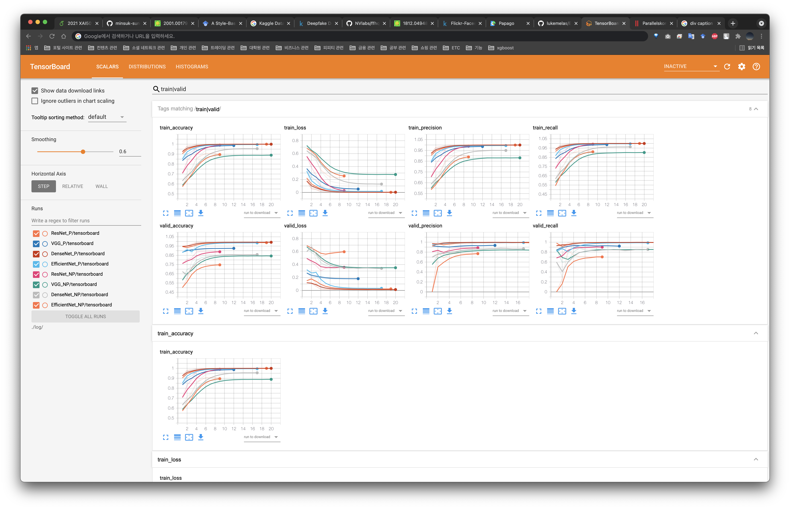</img>

## test.py
```bash
python test.py --config_file configs/VGG.yaml 
```

```
--------------------------------
Running ResNet on device cuda
WARNING: THIS IS TEST MODE!!

[+] System environments
 Device: GeForce RTX 3080
 Random seed : 42
 The number of gpus : 1
 The number of cpus : 20
 Memory Size : 25G

[+] Network
 Type: ResNet
 Checkpoint: ./log/ResNet/checkpoints/0009.pth
 Model parameters: 11,177,538

----------------------------------------------------------------
        Layer (type)               Output Shape         Param #
================================================================
            Conv2d-1         [32, 64, 112, 112]           9,408
       BatchNorm2d-2         [32, 64, 112, 112]             128
              ReLU-3         [32, 64, 112, 112]               0

                            ... SKIP ...

       BasicBlock-66            [32, 512, 7, 7]               0
        AvgPool2d-67            [32, 512, 1, 1]               0
           Linear-68                    [32, 2]           1,026
================================================================
Total params: 11,177,538
Trainable params: 11,177,538
Non-trainable params: 0
----------------------------------------------------------------
Input size (MB): 18.38
Forward/backward pass size (MB): 2009.13
Params size (MB): 42.64
Estimated Total Size (MB): 2070.14
----------------------------------------------------------------
63it [00:01, 44.21it/s]
[+] Test result
 Loss      : 0.28388108
 Accuracy  : 0.90327382
 Precision : 0.91006438
 Recall    : 0.90846158
```

|Models|Pretrained|Accuracy|Precision|Recall|Training times|
|:---|:---:|:---:|:---:|:---:|:---:|
|VGG |O|92.85|94.08|93.02|8m|
|VGG |X|86.21|86.38|87.58|21m|
|ResNet |O|98.41|99.16|99.29|3m|
|ResNet |X|90.32|91.00|90.84|7m|
|DenseNet |O|**98.95**|99.72|**99.79**|21m|
|DenseNet |X|85.66|86.96|85.84|25m|
|EfficientNet |O|98.26|**99.79**|98.34|7m|
|EfficientNet |X|74.65|77.34|70.22|14m|


## visualize.py

```bash
$ python visualize.py --arch=resnet18
                      --target_layer=layer4 
                      --image_paths=samples/fake.jpg
``` 

```
image_paths=samples/fake.jpg
Device: GeForce RTX 3080
----------------------------------------------------------------
        Layer (type)               Output Shape         Param #
================================================================
            Conv2d-1         [32, 64, 112, 112]           9,408
       BatchNorm2d-2         [32, 64, 112, 112]             128
              ReLU-3         [32, 64, 112, 112]               0

                            ... SKIP ...

       BasicBlock-66            [32, 512, 7, 7]               0
        AvgPool2d-67            [32, 512, 1, 1]               0
           Linear-68                    [32, 2]           1,026
================================================================
Total params: 11,177,538
Trainable params: 11,177,538
Non-trainable params: 0
----------------------------------------------------------------
Input size (MB): 18.38
Forward/backward pass size (MB): 2009.13
Params size (MB): 42.64
Estimated Total Size (MB): 2070.14
----------------------------------------------------------------
Images:
        #0: samples/fake.jpg
Vanilla Backpropagation:
        #0: Fake (0.99794)
Deconvolution:
        #0: Fake (0.99794)
Grad-CAM/Guided Backpropagation/Guided Grad-CAM:
        #0: Fake (0.99794)
```

### Visualizing all blocks in ResNet

<div align="center">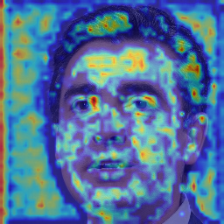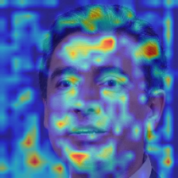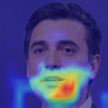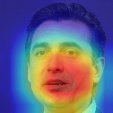</div>

### Visualizing every models (VGG, ResNet, DenseNet, EfficientNet) - Using pretrained

<div align="center">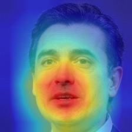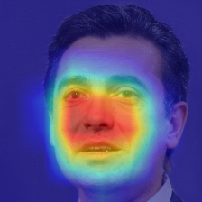</div>

### Visualizing every models (VGG, ResNet, DenseNet, EfficientNet) - Not using pretrained

<div align="center">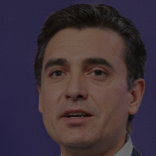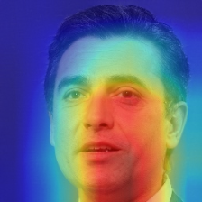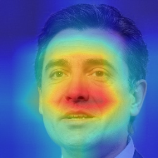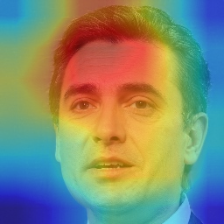</div>

## demo.py

```bash
$ python demo.py --config_file configs/ResNet.yaml
                 --image_path samples/fake.jpg
``` 

```
--------------------------------
Running ResNet on device cuda
WARNING: THIS IS DEMO MODE!!

[+] System environments
 Device: GeForce RTX 3080
 Random seed : 42
 The number of gpus : 1
 The number of cpus : 20
 Memory Size : 26G

[+] Network
 Type: ResNet
 Checkpoint: ./log/ResNet/checkpoints/0009.pth
 Model parameters: 11,177,538

----------------------------------------------------------------
        Layer (type)               Output Shape         Param #
================================================================
            Conv2d-1         [32, 64, 112, 112]           9,408
       BatchNorm2d-2         [32, 64, 112, 112]             128
              ReLU-3         [32, 64, 112, 112]               0

                            ... SKIP ...

       BasicBlock-66            [32, 512, 7, 7]               0
        AvgPool2d-67            [32, 512, 1, 1]               0
           Linear-68                    [32, 2]           1,026
================================================================
Total params: 11,177,538
Trainable params: 11,177,538
Non-trainable params: 0
----------------------------------------------------------------
Input size (MB): 18.38
Forward/backward pass size (MB): 2009.13
Params size (MB): 42.64
Estimated Total Size (MB): 2070.14
----------------------------------------------------------------
[+] Result
 Image path: samples/fake.jpg
 This image is Fake(0.99995)
```

## Reference
- Tolosana, R., Vera-Rodriguez, R., Fierrez, J., Morales, A., & Ortega-Garcia, J. (2020). Deepfakes and beyond: A survey of face manipulation and fake detection. Information Fusion, 64, 131-148.
- BBC Bitesize, “Deepfakes: What Are They and Why Would I Make One?” 2019. [Online]. Available: https://www.bbc.co.uk/bitesize/articles/zfkwcqt
- He, K., Zhang, X., Ren, S., & Sun, J. (2016). Deep residual learning for image recognition. In Proceedings of the IEEE conference on computer vision and pattern recognition (pp. 770-778).
- Simonyan, K., & Zisserman, A. (2014). Very deep convolutional networks for large-scale image recognition. arXiv preprint arXiv:1409.1556.
- Huang, G., Liu, Z., Van Der Maaten, L., & Weinberger, K. Q. (2017). Densely connected convolutional networks. In Proceedings of the IEEE conference on computer vision and pattern recognition (pp. 4700-4708).
- Tan, M., & Le, Q. (2019). Efficientnet: Rethinking model scaling for convolutional neural networks. In International Conference on Machine Learning (pp. 6105-6114). PMLR.
- Zhou, B., Khosla, A., Lapedriza, A., Oliva, A., & Torralba, A. (2016). Learning deep features for discriminative localization. In Proceedings of the IEEE conference on computer vision and pattern recognition (pp. 2921-2929).
- Selvaraju, R. R., Cogswell, M., Das, A., Vedantam, R., Parikh, D., & Batra, D. (2017). Grad-cam: Visual explanations from deep networks via gradient-based localization. In Proceedings of the IEEE international conference on computer vision (pp. 618-626).
- Springenberg, J. T., Dosovitskiy, A., Brox, T., & Riedmiller, M. (2014). Striving for simplicity: The all convolutional net. arXiv preprint arXiv:1412.6806.
- Goodfellow, I. J., Pouget-Abadie, J., Mirza, M., Xu, B., Warde-Farley, D., Ozair, S., ... & Bengio, Y. (2014). Generative adversarial networks. arXiv preprint arXiv:1406.2661.
- E. Gonzalez-Sosa, J. Fierrez, R. Vera-Rodriguez, and F. AlonsoFernandez, “Facial Soft Biometrics for Recognition in the Wild: Recent Works, Annotation and COTS Evaluation,” IEEE Transactions on Information Forensics and Security, vol. 13, no. 8, pp. 2001–2014, 2018.
- M. Liu, Y. Ding, M. Xia, X. Liu, E. Ding, W. Zuo, and S. Wen, “STGAN: A Unified Selective Transfer Network for Arbitrary Image Attribute Editing,” in Proc. IEEE/CVF Conference on Computer Vision and Pattern Recognition, 2019
- J. Thies, M. Zollhofer, M. Stamminger, C. Theobalt, and M. Nießner, “Face2face: Real-Time Face Capture and Reenactment of RGB Videos,” in Proc. IEEE/CVF Conference on Computer Vision and Pattern Recognition, 2016.
- J. Thies, M. Zollhofer, and M. Nießner, “Deferred Neural Rendering: Image Synthesis using Neural Textures,” ACM Transactions on Graphics, vol. 38, no. 66, pp. 1–12, 2019.
- Kingma, D. P., & Ba, J. (2014). Adam: A method for stochastic optimization. arXiv preprint arXiv:1412.6980.

## License


The class is licensed under the [MIT License](http://opensource.org/licenses/MIT):

Copyright (c) 2020 Minsuk Sung

Permission is hereby granted, free of charge, to any person obtaining a copy of this software and associated documentation files (the "Software"), to deal in the Software without restriction, including without limitation the rights to use, copy, modify, merge, publish, distribute, sublicense, and/or sell copies of the Software, and to permit persons to whom the Software is furnished to do so, subject to the following conditions:

The above copyright notice and this permission notice shall be included in all copies or substantial portions of the Software.

THE SOFTWARE IS PROVIDED "AS IS", WITHOUT WARRANTY OF ANY KIND, EXPRESS OR IMPLIED, INCLUDING BUT NOT LIMITED TO THE WARRANTIES OF MERCHANTABILITY, FITNESS FOR A PARTICULAR PURPOSE AND NONINFRINGEMENT. IN NO EVENT SHALL THE AUTHORS OR COPYRIGHT HOLDERS BE LIABLE FOR ANY CLAIM, DAMAGES OR OTHER LIABILITY, WHETHER IN AN ACTION OF CONTRACT, TORT OR OTHERWISE, ARISING FROM, OUT OF OR IN CONNECTION WITH THE SOFTWARE OR THE USE OR OTHER DEALINGS IN THE SOFTWARE.